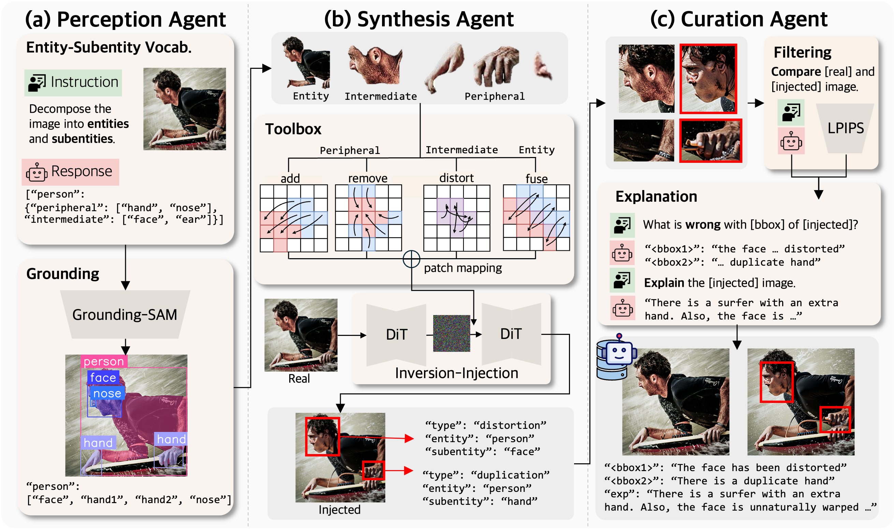

# See and Fix the Flaws: Enabling VLMs and Diffusion Models to Comprehend Visual Artifacts via Agentic Data Synthesis

<div align="center">

[](https://arxiv.org/abs/2602.20951)
[](https://huggingface.co/datasets/KRAFTON/ArtiBench)
[](https://cabbalett.github.io/publications/ArtiAgent/)
</div>

## Overview
**ArtiAgent** comprises three agents to efficiently create pairs of artifact-injected images and its correspondant:
- **Perception agent** recognizes and grounds entities and subentities from real images.
- **Synthesis agent** introduces artifacts via artifact injection tools using a novel patch-wise embedding manipulation of a diffusion transformer.
- **Curation agent** filters synthesized artifacts and generates localized explanations for each instance. 

---

## ArtiAgent Pipeline
<p align="center">

</p>

Our pipeline consists of three specialized agents working in sequence:

### 1. Perception Agent
- **Purpose**: Vocabulary Generation and GSAM segmentation for entity-subentity context understanding
- **Output**: Precise part-level segmentation with patch-based annotations (16×16 patches)
### 2. Synthesis Agent
- **Purpose**: Introduces artifacts via novel patch-wise embedding manipulation
- **Artifact Types**: 
  - **Distortion**: Shape/appearance abnormalities
  - **Omission**: Missing elements with contextual inpainting  
  - **Duplication**: Extra/repeated objects naturally integrated
  - **Fusion**: Blended boundaries of merged objects
- **Output**: Artifact-injected image with it's corresponding original
### 3. Curation Agent (VLM-based)
- **Purpose**: Filters synthesized artifacts and generates localized explanations
- **Output**: Quality-assured artifact pairs with instance-level explanations

## Quick Start

### Environment Setup
Create **two** separate conda environments, following the installation guides.
#### Install GSAM environment
Follow the installation guide in [Grounding SAM installation guide](https://github.com/IDEA-Research/Grounded-Segment-Anything?tab=readme-ov-file#install-without-docker)  to set up the Grounding DINO environment with SAM integration.

Download the pretrained weights, and save it in src/weight directory.
```bash
cd src/weight

wget https://dl.fbaipublicfiles.com/segment_anything/sam_vit_h_4b8939.pth
wget https://github.com/IDEA-Research/GroundingDINO/releases/download/v0.1.0-alpha/groundingdino_swint_ogc.pth
```

#### Install FLUX environment  
Follow the installation guide in [RF-Solver-Edit installation guide](https://github.com/wangjiangshan0725/RF-Solver-Edit/tree/main/FLUX_Image_Edit#%EF%B8%8F-code-setup).


#### OpenAI API Key
Save your OPENAI_API_KEY in .env file.

## Running the Pipeline


### Stage 1: Perception Agent (GSAM Segmentation)
```bash
conda activate gsam
./run_gsam.sh person --dataset coco --dataset-path /path/to/coco --max-images 100 --output-dir /path/to/perception_output
```
### Stage 2: Synthesis Agent (FLUX Generation)  
```bash
conda activate flux
./run_flux.sh /path/to/perception_output --output-dir /path/to/synthesis_output 
```
### Stage 3: Curation Agent (Filtering & Explanation)
```bash
conda activate gsam
python unified_data_pipeline.py --gsam_dir /path/to/perception_output --flux_dir /path/to/synthesis_output --output_dir /path/to/curation_output
```

## Configuration

### Key Parameters

**Perception Agent:**
- `--min-area-ratio`: Minimum part size (default: 0.005 = 0.5% of image)
- `--max-area-ratio`: Maximum part size (default: 0.5 = 50% of image)
- `--box-threshold`: Detection confidence (default: 0.3)
- `--use-sam-hq`: Use higher quality SAM model

**Synthesis Agent:**
- `--inject`: Injection step in diffusion process (default: 25)
- `--guidance`: Guidance scale (default: 5.0)
- `--num-steps`: Diffusion steps (default: 25)
- `--pe-step-*`: Position encoding steps per artifact type

**Curation Agent:**
- `--lpips-threshold`: LPIPS similarity threshold for filtering
- `--explanation-model`: GPT-4o or alternative VLM

See [Configuration Guide](docs/configuration.md) for detailed parameter tuning.


## Acknowledgments

Our pipeline builds upon excellent open-source projects:

- **[RF-Solver-Edit](https://github.com/wangjiangshan0725/RF-Solver-Edit)**: FLUX-based image editing framework
- **[Grounded-SAM](https://github.com/IDEA-Research/Grounded-Segment-Anything)**: Combining GroundingDINO with SAM

Special thanks to the diffusion models and VLM communities for their foundational work!

## License

This project is licensed under the [Creative Commons Attribution-NonCommercial 4.0 International License (CC-BY-NC-4.0)](LICENSE).

Note: This repository integrates third-party components with their own licenses. See `model_licenses/` for details.
