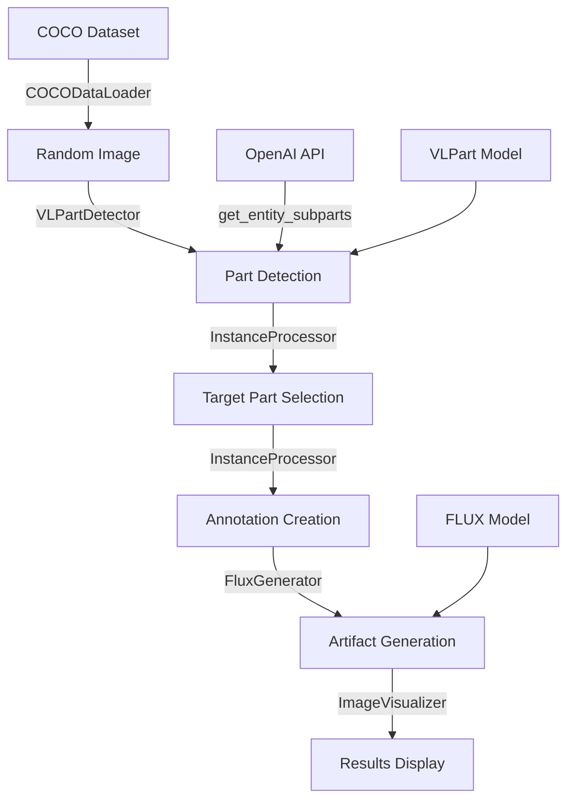

# Image Synthesis Pipeline

A comprehensive pipeline for synthesizing images with artifacts using COCO dataset, VLPart for part detection, and FLUX for image generation.

## Overview

This pipeline decomposes the complex notebook workflow into clean, modular Python components:

```
📦 pipeline/
├── 📄 __init__.py              # Package initialization
├── 📄 data_loader.py           # COCO dataset handling
├── 📄 vlpart_detector.py       # VLPart model integration
├── 📄 instance_processor.py    # Instance filtering and bbox operations
├── 📄 flux_generator.py        # FLUX model operations
├── 📄 visualization.py         # Image visualization utilities
├── 📄 synthesis_pipeline.py    # Main pipeline orchestrator
├── 📄 utils.py                 # OpenAI utilities and helpers
└── 📄 README.md               # This file
```

## Architecture



## Quick Start

### Basic Usage

```python
import openai
from pipeline import SynthesisPipeline, PipelineConfig, FluxConfig

# Setup
openai_client = openai.OpenAI()
pipeline = SynthesisPipeline(openai_client=openai_client)

# Run complete pipeline
results = pipeline.run_full_pipeline(
    artifact_type='distortion',  # 'addition', 'removal', 'distortion'
    super_categories=['person'],
    visualize=True
)
```

### Advanced Configuration

```python
# Custom pipeline configuration
pipeline_config = PipelineConfig(
    dataset_path="path/to/coco/annotations/",
    image_path="path/to/coco/images/",
    super_categories=['person', 'animal'],
    min_area_ratio=0.05,
    max_ref_overlap=0.3,
    min_entity_overlap=0.1,
    device='cuda'
)

# Custom FLUX configuration
flux_config = FluxConfig(
    name='flux-dev',
    guidance=5.0,
    num_steps=25,
    seed=42
)

# FLUX configuration with artifact-type-specific pe_step values
flux_config_custom = FluxConfig(
    name='flux-dev',
    guidance=5.0,
    num_steps=25,
    pe_step={
        'addition': 0.3,      # Lower pe_step for addition artifacts
        'removal': 0.7,       # Higher pe_step for removal artifacts  
        'distortion': 0.5     # Medium pe_step for distortion artifacts
    },
    seed=42
)

pipeline = SynthesisPipeline(
    config=pipeline_config,
    flux_config=flux_config,
    openai_client=openai_client
)
```

## Components

### 1. COCODataLoader

Handles COCO dataset loading and image sampling.

```python
from pipeline import COCODataLoader

loader = COCODataLoader(dataset_path, image_path)
cat_ids = loader.get_category_ids(['person'])
img_info, img_array, caption = loader.sample_image_by_category(cat_ids)
```

### 2. VLPartDetector

Integrates VLPart model for part detection with OpenAI vocabulary generation.

```python
from pipeline import VLPartDetector

detector = VLPartDetector(openai_client=openai_client)
vocab = detector.generate_vocabulary_from_categories(['person'])
detector.setup_model(vocab)
predictions, vis_output = detector.detect_parts(image)
```

### 3. InstanceProcessor

Handles instance filtering, sampling, and bounding box operations.

```python
from pipeline import InstanceProcessor

# Filter and sample instances
sampled_instance, idx = InstanceProcessor.sample_instance_by_score(predictions)

# Generate bbox suggestions for addition artifacts
suggested_bbox = InstanceProcessor.generate_bbox_suggestion(
    predictions, reference_bbox, class_name, vocab
)

# Create annotation dictionary (now returns tuple)
annotation, target_mask = InstanceProcessor.create_annotation_dict(
    instance=sampled_instance,
    img_shape=image.shape,
    vocab=vocab,
    part_class_idx=class_idx,
    prompt=prompt,
    artifact_type=artifact_type
)
```

### 4. FluxGenerator

Manages FLUX model operations and image generation.

```python
from pipeline import FluxGenerator, FluxConfig

# Basic configuration with uniform pe_step
config = FluxConfig(name='flux-dev', guidance=5.0, num_steps=25)

# Advanced configuration with artifact-type-specific pe_step
config_advanced = FluxConfig(
    name='flux-dev', 
    guidance=5.0, 
    num_steps=25,
    pe_step={
        'addition': 0.3,      # Lower pe_step for addition artifacts
        'removal': 0.7,       # Higher pe_step for removal artifacts
        'distortion': 0.5     # Medium pe_step for distortion artifacts
    }
)

generator = FluxGenerator(device='cuda', config=config_advanced)

generated_image = generator.generate_with_artifacts(
    source_prompt=prompt,
    target_prompt=prompt,
    bbox=target_bbox,
    bbox_ref=reference_bbox,
    artifact_type='distortion',  # Will use pe_step=0.5
    source_img=image
)
```

### 5. ImageVisualizer

Provides visualization utilities for images and results.

```python
from pipeline import ImageVisualizer

# Show single image
ImageVisualizer.show_image(image, prompt, title="Original")

# Show comparison
ImageVisualizer.show_comparison(original, generated, prompt)

# Show bounding box overlays
ImageVisualizer.show_bbox_overlay(image, bbox, bbox_ref)

# Create image grids
ImageVisualizer.create_grid(images, titles)
```

### 6. SynthesisPipeline

Main orchestrator that ties all components together.

```python
from pipeline import SynthesisPipeline

pipeline = SynthesisPipeline(openai_client=openai_client)

# Run complete pipeline
results = pipeline.run_full_pipeline('distortion')

# Or run step by step
pipeline.load_random_image(['person'])
pipeline.generate_vocabulary()
pipeline.detect_parts()
sampled_instance, idx, class_name = pipeline.sample_target_part()
annotation = pipeline.create_annotation(sampled_instance, idx, class_name, 'distortion')
generated_image = pipeline.generate_with_artifacts()
```

## Artifact Types

### 1. Distortion
Modifies the appearance of existing parts while keeping them in the same location.

### 2. Removal  
Removes existing parts from the image.

### 3. Addition
Adds new instances of parts in suitable locations using intelligent bbox suggestion.

## Configuration Options

### PipelineConfig

| Parameter | Default | Description |
|-----------|---------|-------------|
| `dataset_path` | `"../../data/coco_2017_extracted/annotations/"` | Path to COCO annotations |
| `image_path` | `"../../data/coco_2017_extracted/train2017/"` | Path to COCO images |
| `super_categories` | `['person']` | Categories to sample from |
| `min_area_ratio` | `0.05` | Minimum area ratio for part filtering |
| `max_ref_overlap` | `0.3` | Max overlap for addition bbox suggestions |
| `min_entity_overlap` | `0.1` | Min entity overlap for addition |
| `device` | `'cuda'` | Device for model inference |

### FluxConfig

| Parameter | Default | Description |
|-----------|---------|-------------|
| `name` | `'flux-dev'` | FLUX model variant |
| `guidance` | `5.0` | Guidance scale |
| `num_steps` | `25` | Number of diffusion steps |
| `pe_step` | `0.5` | Position encoding step size (float or dict) |
| `seed` | `42` | Random seed |

#### Artifact-Type-Specific pe_step

The `pe_step` parameter can be configured per artifact type for fine-tuned control:

```python
# Option 1: Uniform pe_step for all artifact types
flux_config = FluxConfig(pe_step=0.5)

# Option 2: Custom pe_step per artifact type
flux_config = FluxConfig(
    pe_step={
        'addition': 0.3,      # Lower values for subtle additions
        'removal': 0.7,       # Higher values for clean removals
        'distortion': 0.5     # Medium values for balanced distortions
    }
)
```

## Dependencies

- `torch` - PyTorch for deep learning
- `detectron2` - For VLPart integration
- `openai` - For vocabulary generation
- `pycocotools` - For COCO dataset handling
- `matplotlib` - For visualization
- `PIL` - For image processing
- `numpy` - For numerical operations

## Installation

1. Install the required dependencies
2. Set up VLPart model (update paths in config)
3. Set up FLUX model
4. Set OpenAI API key: `export OPENAI_API_KEY='your-key'`
5. Download COCO dataset

## Examples

See `../example_usage.py` for comprehensive examples:

```bash
cd src
python example_usage.py
```

The example includes:
- Full pipeline usage
- Step-by-step execution
- Individual component usage
- Error handling and cleanup

## Error Handling

The pipeline includes robust error handling:

- Model loading failures
- Invalid instance filtering
- Bbox suggestion failures
- Generation errors
- Resource cleanup

## Performance Tips

1. **GPU Memory**: Use `offload=True` in FluxConfig for limited GPU memory
2. **Filtering**: Adjust `min_area_ratio` to balance quality vs. quantity
3. **Caching**: Models are loaded once and reused
4. **Cleanup**: Always call `pipeline.cleanup()` to free resources

## Troubleshooting

### Common Issues

1. **VLPart not found**: Update VLPart paths in `vlpart_detector.py`
2. **VLPart metadata missing**: Download required metadata files (see VLPart Setup below)
3. **FLUX not found**: Ensure FLUX is properly installed
4. **OpenAI API errors**: Check API key and rate limits
5. **COCO dataset errors**: Verify dataset paths and structure
6. **GPU memory issues**: Reduce batch size or use CPU

### VLPart Setup

If you get errors about missing VLPart metadata files, you need to set up VLPart properly:

#### **Automatic Setup (Recommended)**

The pipeline now automatically manages working directory changes to make VLPart config paths work correctly. Just ensure the files exist:

1. **The VLPartDetector automatically**:
   - Changes working directory to VLPart installation during model setup
   - Allows relative paths in config files to resolve correctly  
   - Restores original working directory after setup
   - No manual config file modification needed!

#### **Manual Setup**

1. **Clone VLPart**:
   ```bash
   git clone https://github.com/facebookresearch/VLPart.git
   cd VLPart
   ```

2. **Download metadata files**:
   ```bash
   # Create datasets directory
   mkdir -p datasets/metadata
   
   # Download required files (check VLPart documentation for URLs):
   # - lvis_v1_clip_RN50_a+cname.npy
   # - lvis_v1_train_cat_info.json
   ```

3. **Download model weights**:
   ```bash
   mkdir -p models
   # Download the model weights file to models/ directory
   ```

4. **That's it!** 
   
   The pipeline will automatically handle the config file paths by changing to the VLPart directory during model setup. No manual path fixing needed!

### Debug Mode

Enable debug mode for detailed output:

```python
results = pipeline.run_full_pipeline(
    artifact_type='distortion',
    debug=True  # Enable debug output
)
```

## Contributing

1. Follow the modular architecture
2. Add type hints for all functions
3. Include comprehensive docstrings
4. Add error handling
5. Update tests and examples

## License

This project follows the same license as the parent repository. 